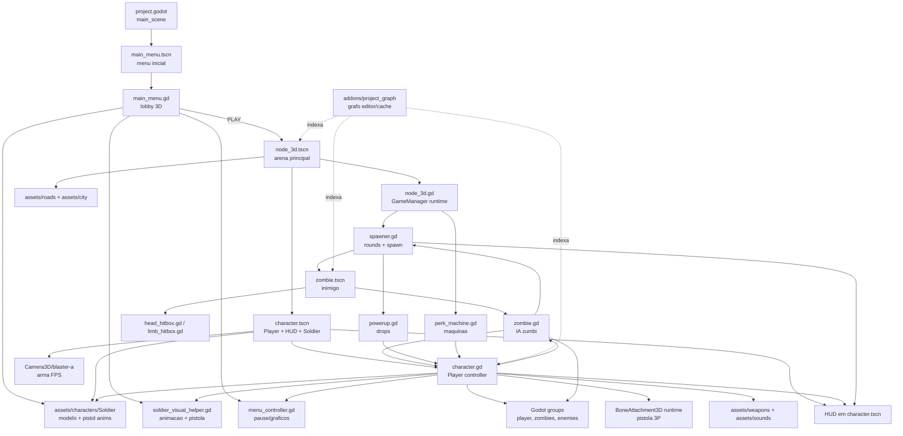
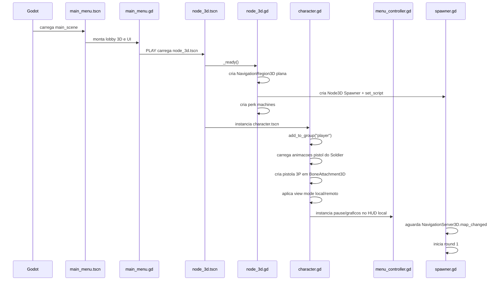
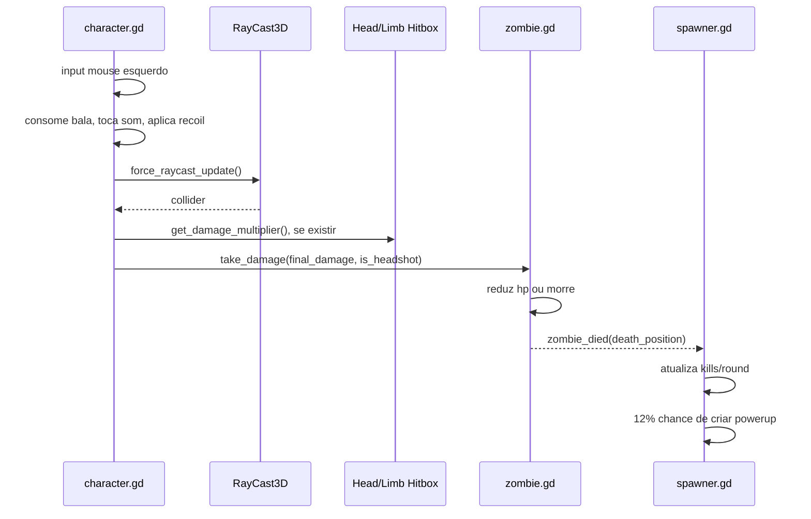
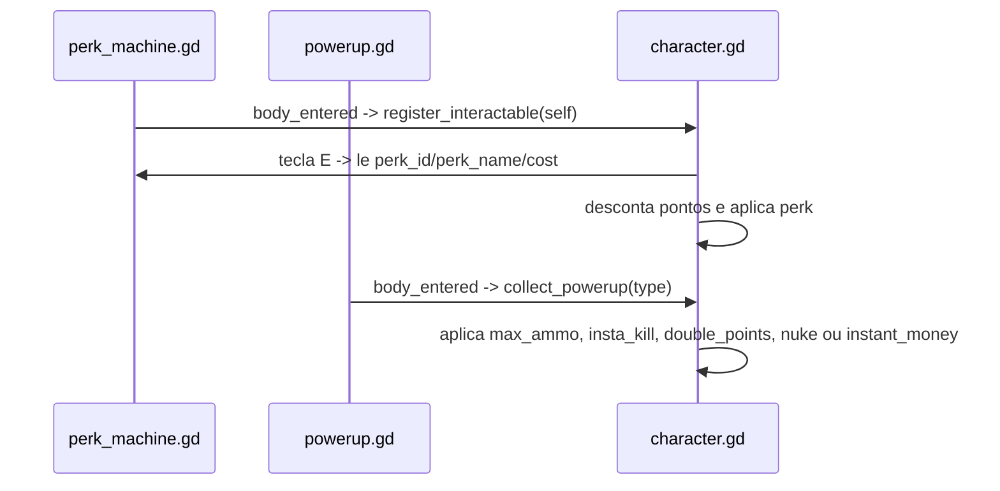

# Grafo de Codigo Persistente - Outbreak Protocol: Pampa

Ultima analise: 2026-06-23.

Este documento reflete o estado atual do projeto apos cancelamentos manuais do usuario. Use este grafo antes de abrir codigo em massa quando for corrigir bug ou implementar funcionalidade. Ele nao e uma arvore de pastas: ele mapeia responsabilidades, dependencias, sinais, dados modificados e riscos reais do codigo atual.

Escopo analisado:

- `project.godot`
- `src/scenes/*.tscn`
- `src/scripts/*.gd`
- referencias `res://` em scripts, cenas, addon e docs
- `addons/project_graph/**` como MCP/addon local de code graph
- `docs/GDD - Outbreak Protocol_ Pampa.md` como direcao de produto

Nota: a pasta `assets/` contem muitos assets importados e tambem um projeto Godot aninhado em `assets/teste-terreno`. Este grafo lista os recursos usados pela cena principal e marca pacotes grandes nao referenciados como orfaos/aparentemente nao integrados.

## 1. Resumo Executivo da Arquitetura

O projeto e um prototipo Godot 4.7, 3D, com cena principal `src/scenes/node_3d.tscn`. O jogo atual roda como arena de rounds estilo zombies: o player nasce no mapa, o `spawner.gd` cria zumbis em volta dele, o player ganha pontos, compra armas por teclas numericas, compra perks em maquinas, coleta powerups e reinicia a cena ao morrer.

O GDD aponta para um jogo maior de extracao, co-op, missoes, loot e persistencia. Esses sistemas ainda nao existem como arquitetura propria. Hoje o codigo esta mais proximo de um prototipo arcade de combate e rounds.

Pontos centrais reais:

- `node_3d.gd` atua como GameManager simples. Ele cria uma navmesh plana, um spawner e tres perk machines em runtime.
- `character.gd` concentra movimento, camera, dual model FPS/terceira pessoa, armas, tiro, recarga, melee, vida, pontos, perks, powerups e HUD.
- `character.tscn` tem a colisao do player, camera FPS, camera terceira pessoa, HUD, arma FPS e Soldier visual `Ch35_nonPBR`.
- O dual model atual e parcial: em FPS local o Soldier fica invisivel e a arma da camera aparece; em terceira pessoa e para players remotos o Soldier e a pistola 3P aparecem. O projeto ainda nao tem rede real sincronizada.
- `zombie.gd` controla IA simples de persegui, atacar, receber dano, morrer e emitir `zombie_died`.
- `spawner.gd` controla rounds, limite de zumbis, spawn via NavigationServer e drops de powerup.
- `main_menu.tscn` e `main_menu.gd` criam o menu inicial isolado da arena, com SubViewport 3D para Soldier em idle e UI de lobby.
- `menu_controller.gd` continua responsavel por pause e menu de graficos, sem criar start menu dentro do HUD do player.
- Nao ha autoloads, save de progresso, inventario geral, missoes, extracao, lobby, RPCs ou sincronizacao multiplayer completa.

## 2. Mapa de Sistemas de Alto Nivel

| Sistema | Arquivos centrais | Estado atual | Responsabilidade |
|---|---|---:|---|
| Bootstrap do projeto | `project.godot` | Implementado | Define cena principal, input, render, Jolt Physics |
| Cena principal / GameManager | `src/scenes/node_3d.tscn`, `src/scripts/node_3d.gd` | Implementado | Monta arena, navmesh plana, spawner e maquinas de perk |
| Player / FPS | `src/scenes/character.tscn`, `src/scripts/character.gd` | Implementado e concentrado | Movimento, camera, vida, tiro, recarga, melee, pontos, HUD |
| Dual model / Soldier | `character.tscn`, `character.gd`, `assets/characters/Soldier/**` | Parcial | Soldier visual em 3P/remoto, animacoes pistol, pistola 3P na mao |
| Armas | `character.gd`, `assets/weapons/blaster-a.glb`, `blaster-d.glb`, `blaster-h.glb`, `assets/sounds/*.mp3` | Implementado no player | Dados de arma, compra, troca, ammo, dano, audio |
| Inimigos | `src/scenes/zombie.tscn`, `src/scripts/zombie.gd`, `head_hitbox.gd`, `limb_hitbox.gd` | Implementado | IA, escala por round, ataque, dano, hitboxes, morte |
| Rounds / spawn | `src/scripts/spawner.gd` | Implementado | Rounds, spawn, limite simultaneo, kills, drops |
| Perks | `src/scripts/perk_machine.gd`, `node_3d.gd`, `character.gd` | Implementado | Maquinas compraveis e efeitos no player |
| Powerups | `src/scripts/powerup.gd`, `spawner.gd`, `character.gd` | Implementado | Drops temporarios e efeitos instantaneos/temporarios |
| Menu inicial 3D | `src/scenes/main_menu.tscn`, `src/scripts/main_menu.gd`, `soldier_visual_helper.gd` | Implementado | Lobby 3D, Soldier idle, botao PLAY e acesso a graficos |
| UI / HUD / Pause | `character.tscn`, `character.gd`, `menu_controller.gd`, `spawner.gd` | Implementado | Labels de jogo, vida, pause e graficos |
| Graficos / performance | `menu_controller.gd`, `project.godot` | Parcial | Presets low/medium/high, escala 3D, AA, shadows, SSAO, glow, fog |
| Inventario | `character.gd` | Parcial | Apenas armas e municao da run |
| Save | `menu_controller.gd` | Minimo | Salva apenas preset grafico em `user://graphics_settings.cfg` |
| Missoes / extracao | Nenhum arquivo dedicado | Ausente | Planejado no GDD |
| Multiplayer | `character.gd` | Pre-configuracao parcial | Usa `is_local_player` e `is_multiplayer_authority`, sem rede real |
| Code graph local | `addons/project_graph/**` | Implementado como addon editor | Indexa cenas, scripts, recursos e relacoes em cache JSON |

## 3. Grafo Mermaid dos Sistemas

## 4. Fluxos Principais

### Inicializacao

### Combate

### Interacao e powerups

## 5. Dependencias Entre Arquivos

| Arquivo | O que faz | Quem utiliza | Quem ele utiliza | Dados que modifica | Eventos dispara | Eventos escuta |
|---|---|---|---|---|---|---|
| `project.godot` | Configura nome, cena principal, input, Jolt e render | Godot runtime | `src/scenes/node_3d.tscn`, `icon.svg` | Configuracoes do projeto | Nenhum | Nenhum |
| `src/scenes/main_menu.tscn` | Cena inicial do jogo | `project.godot` | `main_menu.gd` | Arvore inicial do menu | Nenhum | Nenhum |
| `src/scripts/main_menu.gd` | Cria lobby 3D, operador Soldier, UI e PLAY | `main_menu.tscn` | `soldier_visual_helper.gd`, `menu_controller.gd`, Soldier FBX, `blaster-a.glb`, `node_3d.tscn` | Nodes 3D/UI do menu, mouse visivel | `change_scene_to_file(node_3d.tscn)` no PLAY | `Button.pressed` |
| `src/scenes/node_3d.tscn` | Cena principal da arena com cenario, luz e player | `project.godot` | `node_3d.gd`, `character.tscn`, roads/city assets | Arvore inicial da cena | Nenhum | Nenhum |
| `src/scripts/node_3d.gd` | GameManager simples, cria navmesh, spawner e perks | `node_3d.tscn` | `spawner.gd`, `perk_machine.gd`, `NavigationRegion3D`, `NavigationMesh` | Adiciona filhos runtime na cena | Nenhum customizado | Nenhum customizado |
| `src/scenes/character.tscn` | Player, Soldier visual, cameras, arma FPS, raycast, HUD | `node_3d.tscn` | `character.gd`, `blaster-a.glb`, `Ch35_nonPBR.fbx` | Arvore visual, colisao e HUD | Nenhum | Nenhum |
| `src/scripts/character.gd` | Controla player, armas, dual model, HUD, perks e powerups | `character.tscn`, `zombie.gd`, `spawner.gd`, `powerup.gd`, `perk_machine.gd` | `menu_controller.gd`, `soldier_visual_helper.gd`, Soldier FBXs, armas, sons, grupos `player/zombies` | `points`, `inventory`, `hp`, `max_hp`, `active_perks`, timers, labels, cameras, visibilidade de modelos | Timers nativos para particulas; nao emite sinal customizado | Input, chamadas `take_damage`, `collect_powerup`, `register_interactable` |
| `src/scripts/menu_controller.gd` | Cria pause e graficos reaproveitaveis | `character.gd`, `main_menu.gd` | `ConfigFile`, `SceneTree`, `Viewport`, `WorldEnvironment`, `Light3D`, `Camera3D` | `SceneTree.paused`, mouse mode, preset grafico salvo | `reload_current_scene()`, `change_scene_to_file(main_menu.tscn)`, `quit()` por botoes | `Button.pressed`, `Escape` |
| `src/scripts/soldier_visual_helper.gd` | Helper visual para animacoes pistol e pistola no osso da mao | `character.gd`, `main_menu.gd` | Soldier AnimationPlayer/Skeleton3D, FBXs de animacao, `blaster-a.glb` | AnimationLibrary e BoneAttachment3D runtime | Nenhum | Nenhum |
| `src/scripts/spawner.gd` | Controla rounds, spawn, contador de kills e drops | `node_3d.gd` | `zombie.tscn`, `powerup.gd`, grupo `player`, `NavigationServer3D` | Estado de round, kills, labels de HUD | Instancia zumbis/powerups | `zombie_died`, input F5 |
| `src/scenes/zombie.tscn` | Cena do inimigo com nav agent, modelo, animacoes e hitboxes | `spawner.gd` | `zombie.gd`, `head_hitbox.gd`, `limb_hitbox.gd`, textura referenciada | Arvore do inimigo | Nenhum no arquivo | Nenhum no arquivo |
| `src/scripts/zombie.gd` | IA de zumbi, dano, morte e sinal para spawner | `zombie.tscn`, `spawner.gd`, `character.gd` | Grupo `player`, `NavigationAgent3D`, `AnimationPlayer`, `take_damage` do player | `hp`, `max_hp`, `move_speed`, `state`, `is_dead`, `attack_timer`, visibilidade da cabeca | `zombie_died(death_position)` | `AnimationPlayer.animation_finished`, timer de `queue_free` |
| `src/scripts/head_hitbox.gd` | Multiplicador de headshot | `zombie.tscn`, `character.gd` via raycast | Nenhum arquivo local | Nenhum | Nenhum | Nenhum |
| `src/scripts/limb_hitbox.gd` | Multiplicador reduzido de membros | `zombie.tscn`, `character.gd` via raycast | Nenhum arquivo local | Nenhum | Nenhum | Nenhum |
| `src/scripts/perk_machine.gd` | Cria maquina de perk com visual, colisao e area | `node_3d.gd`, `character.gd` | Metodos `register_interactable` e `unregister_interactable` do player | `player_in_area`, filhos criados em runtime | `Area3D.body_entered/body_exited` conectados internamente | `body_entered`, `body_exited` |
| `src/scripts/powerup.gd` | Cria drop visual e aplica bonus ao player | `spawner.gd`, `character.gd` | Metodo `collect_powerup` do player | `lifespan`, `time`, `visible`, filhos runtime | `Area3D.body_entered` conectado internamente | `body_entered` |
| `src/scenes/road_straight_2.tscn` | Wrapper de estrada reta com colisao | Nenhum uso encontrado | `assets/roads/road-straight.glb` | Arvore de cena | Nenhum | Nenhum |
| `src/scenes/road_crossroad_2.tscn` | Wrapper de cruzamento com colisao | Nenhum uso encontrado | `assets/roads/road-crossroad.glb` | Arvore de cena | Nenhum | Nenhum |
| `src/scenes/character_l_2.tscn` | Wrapper de personagem low poly | Nenhum uso encontrado | Referencia quebrada `assets/characters/character-l.glb` | Arvore de cena | Nenhum | Nenhum |
| `addons/project_graph/project_graph_plugin.gd` | Plugin de editor do ProjectGraph | Godot Editor | `graph_panel.tscn`, core/query do addon | Painel e cache do grafo | Reindex por UI/editor | `resource_saved`, `filesystem_changed`, `reindex_requested` |
| `addons/project_graph/core/*.gd` | Modelo, store, indexer e parsers | Plugin ProjectGraph | APIs de editor, regex, SceneState | Cache `addons/project_graph/.cache/graph_index.json` quando reindexa | Nenhum de gameplay | Mudancas de recursos pelo editor |
| `addons/project_graph/query/*.gd` | Consultas sobre nos, arestas, impacto e caminhos | UI do ProjectGraph | `PG_GraphModel` | Nenhum persistente | Nenhum | Nenhum |
| `addons/project_graph/ui/*.gd/.tscn` | Painel visual do grafo no editor | Plugin ProjectGraph | `PG_GraphQuery`, controles Godot | UI do painel | `reindex_requested` | Cliques e envio de consulta |

## 6. Classes, Herancas e Nos Importantes

| Script | Heranca | Classe nomeada | Nos/referencias importantes |
|---|---|---|---|
| `character.gd` | `CharacterBody3D` | Nenhuma | `$Camera3D`, `$ThirdPersonCameraPivot/ThirdPersonCamera3D`, `$Ch35_nonPBR`, `$Camera3D/RayCast3D`, `$HUD/*`, grupo `player` |
| `main_menu.gd` | `Control` | Nenhuma | `SubViewportContainer`, `SubViewport`, `Menu3DWorld`, Soldier, `menu_controller.gd` |
| `menu_controller.gd` | `Control` | Nenhuma | Pause/graficos criados por codigo, `Viewport`, `SceneTree.paused`, `ConfigFile` |
| `soldier_visual_helper.gd` | `RefCounted` | Nenhuma | `AnimationPlayer`, `Skeleton3D`, `BoneAttachment3D` |
| `spawner.gd` | `Node3D` | Nenhuma | `ZOMBIE_SCENE`, `NavigationServer3D`, primeiro node do grupo `player`, HUD do player |
| `zombie.gd` | `CharacterBody3D` | Nenhuma | `$NavigationAgent3D`, `AnimationPlayer` recursivo, grupo `player`, grupo `zombies`, grupo `enemies` |
| `perk_machine.gd` | `StaticBody3D` | Nenhuma | `Area3D` criada em runtime, propriedades exportadas `perk_id`, `perk_name`, `cost` |
| `powerup.gd` | `Node3D` | Nenhuma | `Area3D`, `MeshInstance3D`, `OmniLight3D`, export `type` |
| `head_hitbox.gd` | `Area3D` | Nenhuma | `get_damage_multiplier()` retorna `3.0` |
| `limb_hitbox.gd` | `Area3D` | Nenhuma | `get_damage_multiplier()` retorna `0.5` |
| `PG_GraphModel` | `RefCounted` | `PG_GraphModel` | Define `GraphNode`, `GraphEdge`, `ProjectGraph` |

Autoloads/singletons:

- Nao ha secao `[autoload]` em `project.godot`.
- Nao existe singleton dedicado para GameState, Save, Audio, Mission, Inventory ou Network.

## 7. Sistema de Player e Dual Model

Estado atual do player:

- Colisao oficial: `CollisionShape3D` capsula em `character.tscn`.
- Visual 3P/remoto: instancia `Ch35_nonPBR` dentro do `CharacterBody3D`.
- Camera FPS: `$Camera3D`, com `RayCast3D`, `MuzzleFlash`, `Flashlight` e arma FPS.
- Camera 3P: `$ThirdPersonCameraPivot/ThirdPersonCamera3D`, alternada por `F3`.
- Animacoes do Soldier: carregadas em runtime de `assets/characters/Soldier/Pistol Animation/`.
- Root motion horizontal: `character.gd` zera tracks de posicao root/`mixamorig:Hips` ao duplicar as animacoes.
- Pistola 3P: `character.gd` cria `BoneAttachment3D` no osso `mixamorig:RightHand` e instancia `blaster-a.glb`.
- Visibilidade local/remoto: `_apply_player_view_mode()` esconde Soldier e pistola 3P no FPS local, mostra em 3P e em jogadores remotos.

Limites atuais:

- O tiro ainda usa o `RayCast3D` da camera FPS mesmo quando a camera terceira pessoa esta ativa.
- Nao existe viewmodel separado de bracos FPS no estado atual.
- Nao ha sincronizacao multiplayer real de posicao, tiro, animacao ou inventario.

## 8. Sinais, Eventos e Comunicacao

| Evento/sinal | Emissor | Receptor | Forma | Impacto |
|---|---|---|---|---|
| `zombie_died(death_position)` | `zombie.gd` | `spawner.gd::_on_zombie_died` | `connect` apos spawn | Atualiza kills, zumbis ativos e chance de drop |
| `AnimationPlayer.animation_finished` | AnimationPlayer do zumbi | `zombie.gd::_on_animation_finished` | `connect` em `_ready()` | Retoma movimento depois de hit/attack |
| `SceneTreeTimer.timeout` | `zombie.gd` | `queue_free` | `create_timer(2.5)` | Remove corpo morto |
| `SceneTreeTimer.timeout` | `character.gd` | `p.queue_free` | `create_timer(1.2)` | Remove particulas de impacto |
| `Area3D.body_entered` | `perk_machine.gd` | `_on_body_entered` | Connect interno | Registra interacao no player |
| `Area3D.body_exited` | `perk_machine.gd` | `_on_body_exited` | Connect interno | Remove interacao do player |
| `Area3D.body_entered` | `powerup.gd` | `_on_body_entered` | Connect interno | Chama `collect_powerup(type)` no player |
| `Button.pressed` | Botao PLAY do menu inicial | `main_menu.gd` | Connect interno | Carrega `node_3d.tscn` |
| `Button.pressed` | Botoes de pause/graficos | `menu_controller.gd` | Connect interno | Pausa, reinicia, volta ao menu, troca graficos ou sai |
| Input `F3` | Jogador local | `character.gd` | `_unhandled_input` | Alterna FPS/terceira pessoa |
| Input `F5` | Debug | `spawner.gd` | `_unhandled_input` | Pula para round 10 |

## 9. Recursos Compartilhados

Usados diretamente pelo gameplay:

- Soldier: `assets/characters/Soldier/Ch35_nonPBR.fbx`
- Animacoes pistol: `pistol idle.fbx`, `pistol walk.fbx`, `pistol run.fbx`, `pistol strafe.fbx`, `pistol jump.fbx`
- Armas: `assets/weapons/blaster-a.glb`, `assets/weapons/blaster-d.glb`, `assets/weapons/blaster-h.glb`
- Sons: `assets/sounds/pistol-shot.mp3`, `pistol-reload.mp3`, `assalt-shot.mp3`, `assalt-reload.mp3`, `shotgun-shot.mp3`, `shotgun-reload.mp3`
- Cenario: `assets/roads/road-straight.glb`, `assets/roads/road-crossroad.glb`, `assets/city/building-a.glb`, `assets/city/building-g.glb`
- Zumbi low poly: modelo montado em `zombie.tscn`, com textura referenciada quebrada no caminho atual.

Usados como dados persistentes:

- `user://graphics_settings.cfg`: salva apenas o preset grafico escolhido.
- `addons/project_graph/.cache/graph_index.json`: cache esperado pelo ProjectGraph quando o editor roda o indexador.

## 10. Gargalos, Acoplamentos e Pontos de Risco

1. `character.gd` concentra sistemas demais. Uma mudanca pequena em camera, arma, HUD, perk ou powerup pode gerar regressao em outra area.
2. O player usa muitos caminhos rigidos de node, como `$HUD/AmmoLabel` e `$Camera3D/RayCast3D`. Renomear nodes quebra runtime.
3. O HUD pertence ao player. Em multiplayer real, `spawner.gd` atualizar o HUD do primeiro player do grupo nao escala.
4. `spawner.gd`, `zombie.gd`, `perk_machine.gd` e `powerup.gd` comunicam com player por grupos e `has_method`. Isso e rapido para prototipo, mas fraco como contrato.
5. A navmesh e um plano gigante criado por codigo. Zumbis nao respeitam obstaculos reais do mapa.
6. `perk_machine.gd` e `powerup.gd` criam visual, colisao e area por codigo. Isso dificulta ajuste visual pelo editor.
7. O menu inicial foi separado da arena, mas o pause/graficos ainda nasce dentro do HUD do player. Em multiplayer real, esse controller deve ficar apenas no player local ou em uma UI local dedicada.
8. Compra de armas esta hardcoded em `KEY_1` e `KEY_2`, dentro do player.
9. O modo terceira pessoa e visual/debug. O tiro continua acoplado ao raycast FPS.
10. `zombie.gd` usa `get_nodes_in_group("player")[0]`, entao inimigos sempre perseguem o primeiro player, nao o mais proximo.
11. `character.gd::_die()` recarrega a cena diretamente. Isso conflita com futuro save, extracao, perda de loot e tela de morte.
12. O GDD descreve extracao e persistencia, mas o codigo atual implementa loop de rounds. Antes de crescer sistemas, o projeto precisa decidir se mantem ambos ou migra o loop central.

## 11. Arquivos Orfaos ou Aparentemente Nao Utilizados

Cenas sem dependente encontrado:

- `src/scenes/road_straight_2.tscn`
- `src/scenes/road_crossroad_2.tscn`
- `src/scenes/character_l_2.tscn`

Pacotes/diretorios sem referencia pela cena principal atual:

- `assets/teste-terreno/**`, contem outro projeto Godot e addon HTerrain.
- A maioria de `assets/weapons/*.glb`, exceto `blaster-a`, `blaster-d`, `blaster-h`.
- A maioria de `assets/roads/*.glb`, exceto `road-straight` e `road-crossroad`.
- A maioria de `assets/city/*.glb`, exceto `building-a` e `building-g`.
- Muitos arquivos `assets/characters/Low Poly/**`, exceto uso indireto provavel para corrigir textura/modelo quebrados.

Observacao: arquivos `.import` nao indicam uso por si so. Eles podem aparecer por reimport automatico do Godot.

## 12. Referencias Quebradas Encontradas

| Origem | Referencia quebrada | Alvo provavel |
|---|---|---|
| `src/scenes/zombie.tscn` | `res://assets/characters/Textures/texture-l.png` | `res://assets/characters/Low Poly/Textures/texture-l.png` |
| `src/scenes/character_l_2.tscn` | `res://assets/characters/character-l.glb` | `res://assets/characters/Low Poly/character-l.glb` |
| `addons/project_graph/core/graph_store.gd` | `res://addons/project_graph/.cache/graph_index.json` ausente ate reindexar | Gerado pelo ProjectGraph no editor |

Nao foi encontrada referencia quebrada nos assets centrais do player Soldier, armas principais, sons principais ou cena principal.

## 13. Ciclos de Dependencia

Ciclos estaticos diretos por `preload/load`: nenhum ciclo critico encontrado entre scripts principais.

Ciclos de runtime relevantes:

1. `character.gd` -> grupo `zombies` -> `zombie.gd` -> grupo `player` -> `character.gd`
   - Motivo: player causa dano nos zumbis, zumbis perseguem e causam dano no player.
   - Risco: grupos/metodos implicitos quebram facil com rename.
2. `spawner.gd` -> `zombie.gd` -> sinal `zombie_died` -> `spawner.gd`
   - Motivo: spawner instancia zumbi e contabiliza morte.
   - Risco: aceitavel, mas todo zumbi criado precisa conectar o sinal.
3. `character.gd` -> `perk_machine.gd` -> `character.gd`
   - Motivo: maquina registra interacao, player le propriedades ao apertar `E`.
   - Risco: contrato implicito por propriedades exportadas.
4. `spawner.gd` -> `powerup.gd` -> `character.gd` -> grupo `zombies`
   - Motivo: spawner cria drop, player coleta, `nuke` mata zumbis pelo grupo global.
   - Risco: efeito global nao diferencia dono/player em multiplayer futuro.
5. `main_menu.gd` -> `menu_controller.gd` -> presets graficos -> cena atual
   - Motivo: menu inicial reaproveita o controller de graficos usado no pause.
   - Risco: mudancas em presets afetam tanto lobby quanto gameplay.

## 14. Sistemas Ausentes ou Parciais em Relacao ao GDD

| Sistema do GDD | Evidencia no codigo atual | Status |
|---|---|---|
| Extracao | Nenhum script/cena de zona de extracao | Ausente |
| Missoes encadeadas | Nenhum quest manager, objetivo ou trigger dedicado | Ausente |
| Inventario de loot | Apenas inventario de armas/municao no player | Parcial |
| Save de progresso | Apenas preset grafico via `ConfigFile` | Ausente para gameplay |
| Co-op 1 a 4 | Apenas `is_local_player` e `is_multiplayer_authority` no player | Pre-configuracao parcial |
| Sincronizacao de rede | Nenhum RPC, ENet, lobby ou authority por entidade | Ausente |
| Stealth/ruido | Sprint existe, zumbis nao reagem a ruido | Ausente |
| Saqueadores rivais | Nenhum NPC humano armado | Ausente |
| Boss/mini-boss | Nenhum arquivo dedicado | Ausente |
| Mapa/inventario por Tab | HUD existe, inventario geral nao | Ausente |
| Economia de sucata | `points` funciona como moeda arcade | Parcial |
| Menu inicial 3D com personagem | `main_menu.tscn` com Soldier em SubViewport | Implementado |

## 15. Roteiro de Navegacao Para Futuras Tarefas

- Bug de movimento, camera, dual model, Soldier, animacao pistol ou F3: comece em `src/scripts/character.gd`, depois `src/scenes/character.tscn`.
- Bug de tiro, recoil, raycast, dano, recarga, ammo ou melee: comece em `src/scripts/character.gd`; se envolver hitbox, abra `zombie.tscn`, `head_hitbox.gd` e `limb_hitbox.gd`.
- Bug de compra de arma: comece em `character.gd`, constantes `WEAPONS`, `_try_buy_weapon()` e `equip_weapon()`.
- Bug de zumbi, perseguicao, ataque, morte ou animacao: comece em `src/scripts/zombie.gd`, depois `src/scenes/zombie.tscn`.
- Bug de spawn, rounds, contador de kills, F5 ou powerup drop: comece em `src/scripts/spawner.gd`.
- Bug de perk/interacao: comece em `src/scripts/perk_machine.gd`, depois `character.gd::_interact_with()`.
- Bug de powerup: comece em `src/scripts/powerup.gd`, depois `character.gd::collect_powerup()`.
- Bug de menu inicial, operador ou PLAY: comece em `src/scripts/main_menu.gd` e `src/scenes/main_menu.tscn`.
- Bug de pause ou graficos: comece em `src/scripts/menu_controller.gd`; depois veja a instanciacao em `character.gd::_ready()` e `main_menu.gd`.
- Mudanca de mapa, navmesh ou objetos criados no inicio: comece em `src/scripts/node_3d.gd` e `src/scenes/node_3d.tscn`.
- Implementar save/extracao/missoes: crie sistemas separados e integre nos pontos criticos `character.gd::_die()`, economia de `points`, estado de round em `spawner.gd` e carregamento da cena principal.
- Implementar multiplayer real: primeiro separe HUD/local input do player replicado, depois troque buscas por primeiro `player` por escolha de alvo/authority clara.

## 16. ProjectGraph Local

O addon `addons/project_graph` ja modela um grafo mecanico do projeto para uso no editor.

Tipos de nos definidos em `PG_GraphModel`:

- `scene`
- `script`
- `resource`
- `node`
- `function`
- `signal_def`
- `variable`
- `constant`
- `class`
- `group`

Tipos de arestas definidos:

- `has_script`
- `has_node`
- `extends`
- `preloads`
- `calls_function`
- `emits_signal`
- `connects_signal`
- `exports_var`
- `uses_resource`
- `instances_scene`
- `belongs_to_group`
- `has_function`
- `has_signal`
- `has_variable`
- `has_constant`
- `scene_connects_signal`

Cache esperado:

- `res://addons/project_graph/.cache/graph_index.json`

Uso recomendado: rode o reindex no painel ProjectGraph quando abrir o projeto no editor. Este Markdown fica como versao humana revisada, e o cache JSON fica como apoio mecanico para consultas de impacto.
